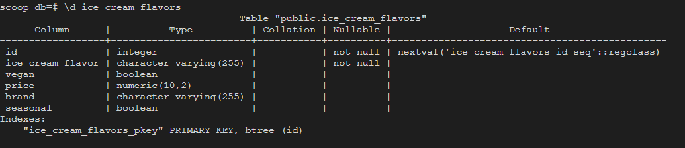
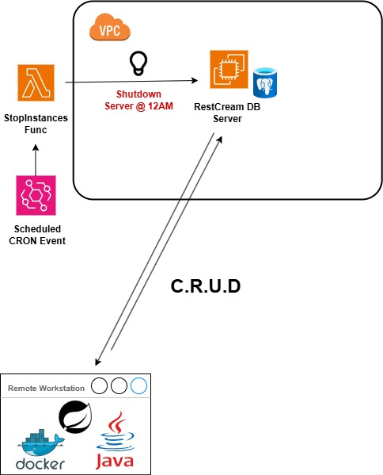

# RestCream
This is a SpringBoot application that provides RESTful APIs
to perform REST operations on a remote PostgreSQL database hosted in AWS. This project is still currently in development and there are plans to continue enhancing not only the security, but also the scope of the project. The database has a table that has over 1000 rows of data for different kinds of ice cream flavors. The schema for the `ice_cream_flavors` table is as follows:

## Current Architecture
The Database is currently hosted on an EC2 server. As of now, Only the developers are allowed to connect to the Database. There is a daily CRON event system that will trigger the shutdown of the server in case a developer forgets to turn it off in order to save on cloud compute costs.

## How to build 
In the root project dir, run docker build to build the image:  
`docker build -t rest-cream:latest .`

Run using the designated port for SpringBoot:  
`docker run -d --name=restcream -p 8080:8080 rest-cream`